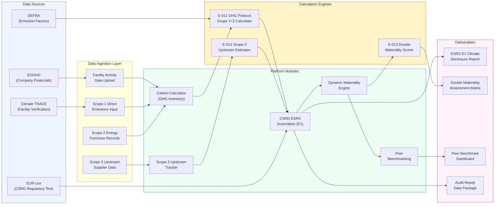
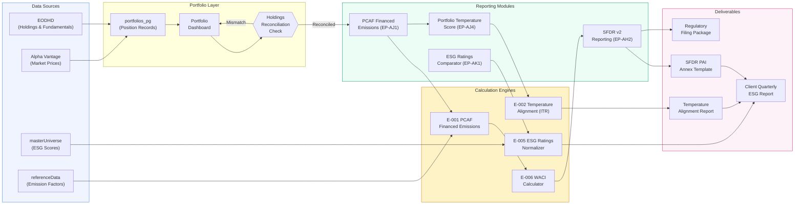
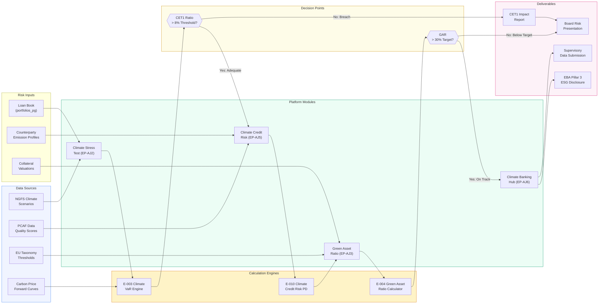
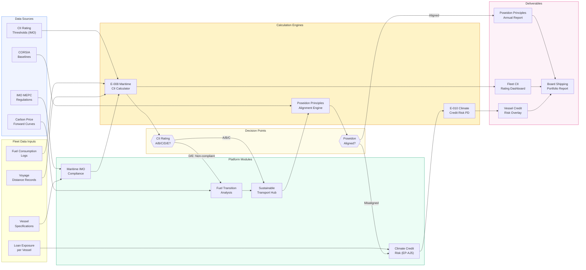
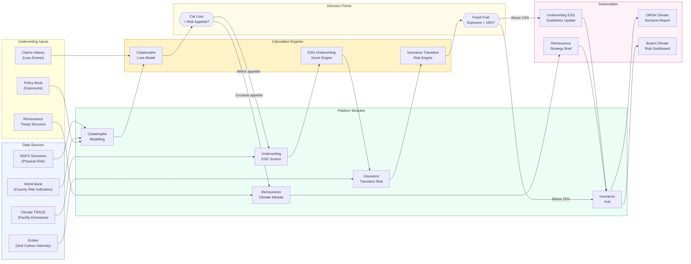
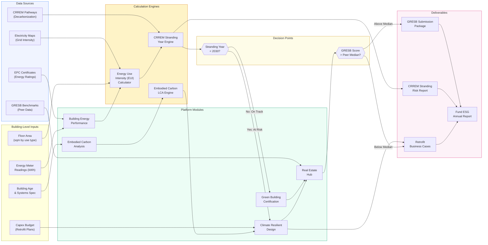
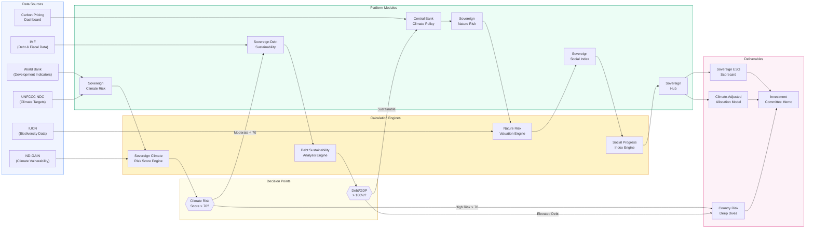

# Persona Flow Diagram Prompts

> Detailed text prompts for generating professional flow diagrams using generative AI tools
> (Mermaid.js, Lucidchart AI, Whimsical AI, Claude artifacts, ChatGPT canvas, etc.)
> for each of the 7 institutional personas on the AA Impact sustainability analytics platform.
>
> Last updated: 2026-03-29

---

## Table of Contents

| # | Persona | Role | Primary Deliverable |
|---|---------|------|---------------------|
| 1 | ESG Analyst — Corporate CSRD Reporter | Sustainability team lead, mid-cap EU company | CSRD ESRS E1 disclosure |
| 2 | Portfolio Manager — SFDR Article 9 Fund | PM managing a EUR 5bn sustainable equity fund | SFDR PAI report + client deck |
| 3 | Climate Risk Officer — EBA Pillar 3 Bank | Head of climate risk, universal bank | EBA Pillar 3 ESG disclosure |
| 4 | Shipping Finance Analyst — IMO/Poseidon | Analyst, maritime lending institution | Poseidon Principles portfolio report |
| 5 | Insurance Underwriter — Solvency II Climate | Climate risk lead, global insurer | ORSA climate scenario submission |
| 6 | Real Estate Fund Manager — CRREM/GRESB | Sustainability director, EUR 3bn RE fund | GRESB submission package |
| 7 | Sovereign Bond Investor | Sovereign credit analyst, large asset manager | Sovereign climate allocation model |

---

## Persona 1: ESG Analyst at a Corporate (CSRD Reporter)

**Role**: Sustainability team lead at a mid-cap European company
**Primary workflow**: Annual GHG inventory --> CSRD ESRS E1 disclosure --> Double materiality --> Peer benchmark
**Modules**: Carbon Calculator --> Scope 3 Upstream --> CSRD ESRS Automation --> Materiality Engine --> Peer Benchmarking
**Data sources**: EODHD (own company data), Climate TRACE (facility verification), DEFRA emission factors, EUR-Lex (regulatory text)

### 1A. Mermaid Flowchart

### 1B. AI Diagram Prompt (Whimsical / Lucidchart AI)

"Create a professional left-to-right flow diagram showing the annual CSRD reporting workflow of a sustainability team lead at a mid-cap European company using the AA Impact platform. Begin with four data sources on the left: EODHD company financials, Climate TRACE facility emissions, DEFRA emission factor database, and EUR-Lex CSRD regulatory text. Data flows into a Carbon Calculator module that computes Scope 1 and Scope 2 emissions using the GHG Protocol engine (E-011), then into a Scope 3 Upstream Tracker that estimates upstream supply chain emissions using engine E-012. Both outputs feed the CSRD ESRS Automation module which assembles the ESRS E1 climate disclosure. A decision diamond after CSRD assembly asks 'Materiality threshold exceeded?' branching YES into the Dynamic Materiality Engine (E-013 scorer) and NO into an optional peer benchmarking step. The materiality engine produces a Double Materiality Assessment Matrix. Final outputs are the ESRS E1 Disclosure Report, Materiality Matrix, Peer Benchmark Dashboard, and Audit-Ready Data Package. Use a blue-to-green color scheme with rounded rectangles for modules, hexagons for engines, and cylinders for data sources."

### 1C. Data Flow Diagram Prompt

"Create a data flow diagram (DFD) showing how Scope 1 emission data enters the AA Impact platform from facility-level activity records uploaded by the corporate ESG analyst. Raw activity data (fuel consumption in litres, natural gas in cubic metres, refrigerant leaks in kg) is ingested via the Carbon Calculator module, transformed by the GHG Protocol calculation engine (E-011) using DEFRA emission factors stored in the reference_data table, producing tCO2e values stored in the ghg_inventories table. These emission totals are then consumed by the CSRD ESRS Automation module which maps them to ESRS E1 datapoints (E1-1 through E1-9), validated against Climate TRACE satellite data for facility-level verification, and finally assembled into the ESRS E1 disclosure XML output. Show every transformation step with field-level detail: activity_litres --> emission_factor_kgCO2e_per_litre --> scope1_tCO2e --> esrs_e1_datapoint. Include the data quality score assignment at each stage."

---

## Persona 2: Portfolio Manager at an Asset Manager (SFDR Article 9)

**Role**: PM managing a EUR 5bn sustainable equity fund
**Primary workflow**: Portfolio construction --> PCAF financed emissions --> SFDR PAI reporting --> Temperature alignment --> Client report
**Modules**: Portfolio Dashboard --> PCAF Financed Emissions --> SFDR v2 Reporting --> Portfolio Temperature Score --> ESG Ratings Comparator --> Client Report
**Data sources**: EODHD (holdings data), Alpha Vantage (prices), masterUniverse (ESG scores), referenceData (emission factors)

### 2A. Mermaid Flowchart

### 2B. AI Diagram Prompt (Whimsical / Lucidchart AI)

"Create a professional flow diagram showing the quarterly reporting workflow of a portfolio manager running a EUR 5bn SFDR Article 9 sustainable equity fund on the AA Impact platform. Start with four data sources: EODHD for holdings and fundamentals, Alpha Vantage for market prices, masterUniverse for ESG scores, and referenceData for emission factors. Data feeds into the portfolios_pg database and the Portfolio Dashboard module. Include a decision diamond for 'Holdings Reconciliation Check' that branches into reconciled (continue) or mismatch (loop back). The reconciled path flows through PCAF Financed Emissions module (EP-AJ1) using the E-001 PCAF engine, then forks into two parallel tracks: Track A goes to SFDR v2 Reporting (EP-AH2) via E-006 WACI Calculator producing the SFDR PAI Annex template; Track B goes to Portfolio Temperature Score (EP-AJ4) via E-002 ITR engine producing a temperature alignment report. Both tracks converge into the Client Quarterly ESG Report. A side branch from masterUniverse flows through ESG Ratings Comparator (EP-AK1) using E-005 Ratings Normalizer, also feeding the client report. Use navy and gold color scheme with data source cylinders, module rectangles, and engine hexagons."

### 2C. Data Flow Diagram Prompt

"Create a data flow diagram showing how portfolio position data flows through the AA Impact platform for an SFDR Article 9 fund manager. Starting from the portfolios_pg table containing position records (ticker, outstanding_amount, evic, asset_class), each position is processed by the E-001 PCAF Financed Emissions engine which calculates: attribution_factor = min(1.0, outstanding / EVIC), financed_emissions = attribution_factor * total_emissions. The position-level results are stored in the pcaf_results table. The E-006 WACI engine then aggregates these into portfolio-level weighted average carbon intensity (sum of position WACI / total portfolio value). These portfolio-level metrics flow into the SFDR v2 Reporting module (EP-AH2) which maps them to PAI indicators: PAI-1 (GHG Scope 1), PAI-2 (GHG Scope 2), PAI-3 (Carbon Footprint), PAI-4 (GHG Intensity). Show field-level transformations at each step with data types, units (tCO2e, tCO2e per EUR million invested), and the PCAF Data Quality Score (1-5) that propagates through the chain."

---

## Persona 3: Climate Risk Officer at a Bank (EBA Pillar 3)

**Role**: Head of climate risk at a universal bank
**Primary workflow**: Climate stress test --> CET1 impact --> Credit risk overlay --> Green Asset Ratio --> EBA Pillar 3 disclosure
**Modules**: Climate Stress Test --> Climate Credit Risk --> Green Asset Ratio --> Climate Banking Hub --> EBA Pillar 3
**Data sources**: NGFS scenarios, PCAF data quality, EU Taxonomy thresholds, carbon prices

### 3A. Mermaid Flowchart

### 3B. AI Diagram Prompt (Whimsical / Lucidchart AI)

"Create a professional flow diagram for a Head of Climate Risk at a universal bank using the AA Impact platform for EBA Pillar 3 ESG disclosure. Start with four data inputs: NGFS climate scenarios (Hot House, Orderly, Disorderly), PCAF data quality scores, EU Taxonomy technical screening criteria, and carbon price forward curves. The loan book from portfolios_pg feeds into the Climate Stress Test module (EP-AJ2) which runs the E-003 Climate VaR engine across three NGFS scenarios. Include a critical decision diamond: 'CET1 ratio above 8% minimum after climate stress?' If YES, proceed to Climate Credit Risk module (EP-AJ5) using E-010 PD adjustment engine that overlays climate-adjusted default probabilities. If NO, generate an escalation CET1 Impact Report for the board. From credit risk, flow into Green Asset Ratio module (EP-AJ3) using E-004 GAR Calculator with EU Taxonomy thresholds. Include a second decision diamond: 'GAR above 30% strategic target?' Both paths converge at Climate Banking Hub (EP-AJ6) which assembles the EBA Pillar 3 ESG disclosure and supervisory data submission. Use a dark navy and amber color scheme suitable for a banking risk dashboard."

### 3C. Data Flow Diagram Prompt

"Create a data flow diagram showing how NGFS climate scenario data flows through the AA Impact platform for a bank's climate stress test. Starting from the NGFS scenario parameters (temperature pathway, carbon price trajectory, GDP shock by sector), the E-003 Climate VaR engine applies sector-level transition risk shocks to each loan in the portfolios_pg table. For each counterparty: transition_risk_loss = exposure * sector_carbon_intensity * carbon_price_delta * elasticity_factor. The engine then computes portfolio-level Climate VaR at 95th and 99th percentiles, stored in the stress_test_results table. These feed into the E-010 Climate Credit Risk PD engine which adjusts baseline PDs: climate_adjusted_PD = baseline_PD * (1 + climate_risk_factor). Show the complete chain from raw NGFS scenario JSON through sector mapping, counterparty attribution, portfolio aggregation, CET1 impact calculation (CET1_impact = total_climate_loss / risk_weighted_assets), and final EBA Pillar 3 template population. Include the data quality scoring at each transformation."

---

## Persona 4: Shipping Finance Analyst (IMO/Poseidon)

**Role**: Analyst at a maritime lending institution
**Primary workflow**: Fleet CII assessment --> Poseidon Principles --> Fuel transition analysis --> Credit risk --> Portfolio report
**Modules**: Maritime IMO Compliance --> Sustainable Transport Hub --> Climate Credit Risk --> Board Report
**Data sources**: CII thresholds, CORSIA baselines, carbon prices, IMO regulations

### 4A. Mermaid Flowchart

### 4B. AI Diagram Prompt (Whimsical / Lucidchart AI)

"Create a professional flow diagram for a shipping finance analyst at a maritime lending institution using the AA Impact platform for IMO compliance and Poseidon Principles reporting. Start with vessel-level data inputs: vessel specifications (DWT, vessel type, build year), fuel consumption logs, voyage distance records, and loan exposure amounts. These feed into the Maritime IMO Compliance module which calculates vessel-level CII ratings using the E-008 Maritime CII Calculator engine (AER = CO2 emissions / (DWT * distance)). Include a decision diamond for CII Rating with branches: A/B/C rated vessels proceed to the Sustainable Transport Hub; D/E rated non-compliant vessels are routed through a Fuel Transition Analysis module that evaluates LNG, methanol, ammonia, and hydrogen pathways. Both paths converge at the Poseidon Principles Alignment Engine which checks portfolio-level alignment against the IMO decarbonization trajectory. Include a second decision diamond: 'Portfolio Poseidon-aligned?' YES produces the Poseidon Principles Annual Report; NO triggers a Climate Credit Risk overlay (E-010) that adjusts loan PDs for stranded asset risk. All outputs feed a Board Shipping Portfolio Report. Use maritime blue and steel grey color scheme."

### 4C. Data Flow Diagram Prompt

"Create a data flow diagram showing how vessel fuel consumption data flows through the AA Impact platform for Poseidon Principles reporting. Starting from raw fuel consumption logs (vessel_id, fuel_type, quantity_mt, voyage_id) and voyage records (origin_port, destination_port, distance_nm), the E-008 Maritime CII Calculator computes: AER = (fuel_consumption_mt * emission_factor_tCO2_per_mt) / (DWT * distance_nm). The emission_factor is looked up from the IMO fuel factors table (HFO: 3.114, VLSFO: 3.151, LNG: 2.750). Each vessel receives a CII rating (A through E) by comparing its attained CII against the required CII from the IMO thresholds table, which tightens by 2% annually. Show the vessel-level CII scores being aggregated into a portfolio-level Poseidon alignment score: portfolio_alignment = sum(vessel_loan_exposure * vessel_trajectory_delta) / total_portfolio_exposure. Include the trajectory delta calculation that compares attained AER against the IMO 2050 trajectory at each year."

---

## Persona 5: Insurance Underwriter (Solvency II Climate)

**Role**: Climate risk lead at a global insurer
**Primary workflow**: Cat model --> ESG underwriting screen --> Fossil fuel exposure --> Reinsurance --> ORSA climate scenario
**Modules**: Catastrophe Modelling --> Underwriting ESG --> Insurance Transition --> Reinsurance Climate --> Insurance Hub
**Data sources**: Climate TRACE (facility emissions), NGFS scenarios, Ember (grid intensity), World Bank (country risk)

### 5A. Mermaid Flowchart

### 5B. AI Diagram Prompt (Whimsical / Lucidchart AI)

"Create a professional flow diagram for a climate risk lead at a global insurer using the AA Impact platform for Solvency II ORSA climate scenario analysis. Begin with four external data sources: Climate TRACE facility emissions, NGFS physical risk scenarios (RCP 2.6, 4.5, 8.5), Ember grid carbon intensity data, and World Bank country risk indicators. The policy book (exposures by geography and line of business) and historical claims data feed into the Catastrophe Modelling module which runs a probabilistic loss model. Include a decision diamond: 'Catastrophe loss exceeds risk appetite threshold?' If YES, escalate to Reinsurance Climate module to restructure treaty protection; if NO, proceed to Underwriting ESG Screen which scores each policy against an ESG risk matrix using Climate TRACE emission data. The screened book flows into the Insurance Transition Risk module that calculates fossil fuel exposure concentration. Include a second decision diamond: 'Fossil fuel exposure above 15% of GWP?' If YES, trigger an Underwriting Guidelines Update; if NO, proceed to Insurance Hub which compiles the ORSA Climate Scenario Report and Board Climate Risk Dashboard. Use a deep teal and warm grey color scheme appropriate for an insurance risk function."

### 5C. Data Flow Diagram Prompt

"Create a data flow diagram showing how physical climate risk data flows through the AA Impact platform for an insurer's ORSA climate scenario. Starting from NGFS physical risk scenario parameters (sea level rise projections, tropical cyclone intensity multipliers, wildfire frequency increases by region), the Catastrophe Loss Model engine applies hazard multipliers to the insurer's exposure database: adjusted_AAL = baseline_AAL * (1 + climate_hazard_multiplier). The baseline AAL (Average Annual Loss) comes from the policy_exposures table aggregated by peril and geography. Results are stored in the cat_model_results table with fields: peril, region, return_period, gross_loss, net_loss_after_reinsurance. These flow into the Insurance Transition Risk module which overlays carbon intensity from Ember (grid_carbon_gCO2_per_kWh by country) to calculate the portfolio's Scope 3 financed emissions from insured assets. Show the complete data lineage from raw NGFS scenario JSON through hazard mapping, exposure aggregation, loss modelling, reinsurance netting, and final ORSA template population including stressed SCR (Solvency Capital Requirement) calculations."

---

## Persona 6: Real Estate Fund Manager (CRREM/GRESB)

**Role**: Sustainability director at a EUR 3bn real estate fund
**Primary workflow**: Building energy audit --> CRREM stranding --> Green certification --> Retrofit planning --> GRESB submission
**Modules**: Building Energy Performance --> Green Building Certification --> Embodied Carbon --> Climate Resilient Design --> RE Hub
**Data sources**: Electricity Maps (grid intensity), EPC data, CRREM pathways, GRESB benchmarks

### 6A. Mermaid Flowchart

### 6B. AI Diagram Prompt (Whimsical / Lucidchart AI)

"Create a professional flow diagram for a sustainability director at a EUR 3bn real estate fund using the AA Impact platform for CRREM stranding analysis and GRESB submission. Start with building-level data inputs: energy meter readings (monthly kWh by fuel type), floor area by use type (office, retail, residential), building age and HVAC specifications, and retrofit capex budgets. External data sources include Electricity Maps grid carbon intensity, EPC energy certificates, CRREM 1.5C decarbonization pathways, and GRESB peer benchmark data. The Energy Use Intensity calculator converts raw meter data into kWh/sqm/year, which feeds the CRREM Stranding Year Engine that plots each building against the CRREM 1.5C pathway. Include a critical decision diamond: 'Stranding year before 2030?' If YES (at risk), route to Climate Resilient Design module for retrofit planning with the Embodied Carbon LCA Engine calculating the whole-life carbon of retrofit interventions. If NO (on track), route to Green Building Certification tracking. Both paths converge at the Real Estate Hub which compiles GRESB indicators. Include a second decision diamond: 'GRESB score above peer median?' producing either the submission package or additional retrofit business cases. Use green and warm stone color scheme befitting real estate."

### 6C. Data Flow Diagram Prompt

"Create a data flow diagram showing how building energy data flows through the AA Impact platform for CRREM stranding analysis. Starting from monthly energy meter readings (building_id, month, electricity_kWh, gas_kWh, district_heating_kWh), the EUI Calculator engine normalizes to: EUI = total_energy_kWh / gross_internal_area_sqm. Grid carbon intensity from Electricity Maps (gCO2/kWh by country and year) converts EUI into carbon intensity: CI = (electricity_kWh * grid_factor + gas_kWh * 0.184) / GIA_sqm, producing kgCO2/sqm/year. The CRREM Stranding Year Engine then projects this CI forward using the building's planned interventions and compares against the CRREM 1.5C pathway for the relevant building type and country: stranding_year = first year where projected_CI > CRREM_target_CI. Results are stored in the building_performance table with fields: building_id, current_eui, current_ci, stranding_year, capex_required_to_avoid_stranding. Show how this building-level data aggregates to fund-level metrics for GRESB: fund_average_eui, percent_buildings_stranded_by_2030, total_retrofit_capex_pipeline."

---

## Persona 7: Sovereign Bond Investor

**Role**: Sovereign credit analyst at a large asset manager
**Primary workflow**: Country climate risk --> Debt sustainability --> Central bank policy --> Nature risk --> Social index --> Portfolio allocation
**Modules**: Sovereign Climate Risk --> Sovereign Debt Sustainability --> Central Bank Climate --> Sovereign Nature Risk --> Sovereign Social Index --> Sovereign Hub
**Data sources**: World Bank, IMF, ND-GAIN, UNFCCC NDC, Carbon Pricing Dashboard, IUCN

### 7A. Mermaid Flowchart

### 7B. AI Diagram Prompt (Whimsical / Lucidchart AI)

"Create a professional flow diagram for a sovereign credit analyst at a large asset manager using the AA Impact platform for climate-adjusted sovereign bond allocation. Start with six external data sources arranged vertically on the left: World Bank Development Indicators, IMF debt and fiscal data, ND-GAIN climate vulnerability index, UNFCCC Nationally Determined Contributions (NDCs), World Bank Carbon Pricing Dashboard, and IUCN biodiversity data. Data flows into the Sovereign Climate Risk module which produces a composite climate risk score (0-100) using the Sovereign Climate Risk Score Engine combining physical vulnerability (ND-GAIN), transition readiness (NDC ambition), and adaptation capacity (World Bank governance indicators). Include a decision diamond: 'Climate risk score above 70?' High-risk countries are flagged for deep-dive analysis. Moderate-risk countries flow to Sovereign Debt Sustainability module using the DSA Engine (IMF framework). Include a second decision diamond: 'Debt-to-GDP above 100%?' Sustainable countries continue through Central Bank Climate Policy module, then Sovereign Nature Risk (IUCN biodiversity dependency), then Sovereign Social Index. All paths converge at the Sovereign Hub which produces a comprehensive ESG Scorecard and Climate-Adjusted Allocation Model. Final output is an Investment Committee Memo. Use a sophisticated dark blue and silver color scheme suitable for institutional fixed income."

### 7C. Data Flow Diagram Prompt

"Create a data flow diagram showing how multi-source country-level data flows through the AA Impact platform for sovereign bond ESG analysis. Starting from six data feeds: (1) World Bank WDI API delivering GDP, governance indicators, and adaptation spending; (2) IMF WEO delivering debt-to-GDP, fiscal balance, and external debt; (3) ND-GAIN index delivering vulnerability and readiness scores; (4) UNFCCC NDC registry delivering emission reduction targets and policy measures; (5) Carbon Pricing Dashboard delivering carbon price levels and coverage; (6) IUCN Red List delivering species threat counts and protected area coverage. The Sovereign Climate Risk Score Engine combines these into a composite score: SCR = 0.30 * physical_vulnerability + 0.25 * transition_readiness + 0.20 * policy_ambition + 0.15 * nature_dependency + 0.10 * social_resilience, with each component normalized to 0-100. This score is stored in the sovereign_risk_scores table. The DSA Engine then calculates climate-adjusted debt sustainability: climate_fiscal_impact = physical_damage_pct_GDP + adaptation_spending_gap + stranded_asset_writedown, feeding into adjusted_debt_trajectory = baseline_debt_path + cumulative_climate_fiscal_impact. Show field-level data transformations from raw API responses through normalization, scoring, weighting, and final portfolio allocation optimization."

---

## Appendix A: Color Scheme Reference

All diagrams use a consistent four-zone color scheme:

| Zone | Background | Border | Usage |
|------|-----------|--------|-------|
| Data Sources | `#f0f4ff` (light blue) | `#3b82f6` (blue-500) | External APIs, databases, file uploads |
| Calculation Engines | `#fef3c7` (light amber) | `#d97706` (amber-600) | E-001 through E-013 engines |
| Platform Modules | `#ecfdf5` (light green) | `#059669` (emerald-600) | EP-prefixed feature modules |
| Deliverables | `#fdf2f8` (light pink) | `#db2777` (pink-600) | Reports, dashboards, filings |
| Decision Points | `#fefce8` (light yellow) | `#ca8a04` (yellow-600) | Threshold checks, branching logic |

---

## Appendix B: Engine Cross-Reference

| Engine ID | Engine Name | Used By Personas |
|-----------|-------------|------------------|
| E-001 | PCAF Financed Emissions | 2, 3 |
| E-002 | Temperature Alignment (ITR) | 2 |
| E-003 | Climate VaR | 3 |
| E-004 | Green Asset Ratio Calculator | 3 |
| E-005 | ESG Ratings Normalizer | 2 |
| E-006 | WACI Calculator | 2 |
| E-008 | Maritime CII Calculator | 4 |
| E-010 | Climate Credit Risk PD | 3, 4 |
| E-011 | GHG Protocol Scope 1+2 | 1 |
| E-012 | Scope 3 Upstream Estimator | 1 |
| E-013 | Double Materiality Scorer | 1 |

---

## Appendix C: Tool Compatibility Notes

| Tool | Mermaid Support | AI Prompt Support | Notes |
|------|----------------|-------------------|-------|
| Mermaid Live Editor | Full | N/A | Paste code blocks directly at mermaid.live |
| GitHub / GitLab | Full | N/A | Renders in markdown files natively |
| Whimsical AI | N/A | Full | Use Section B prompts with "Generate flowchart" |
| Lucidchart AI | Partial import | Full | Import Mermaid via Lucidchart Labs plugin |
| Claude Artifacts | Full | Full | Both Mermaid code and natural language work |
| ChatGPT Canvas | Full | Full | Supports Mermaid rendering and prompt-based |
| Notion | Partial | N/A | Mermaid via /code block, limited styling |
| Confluence | Plugin required | N/A | Mermaid plugin available in Marketplace |
| draw.io / diagrams.net | Import via Mermaid | N/A | File > Import > Mermaid option |

---

*Generated for the AA Impact Sustainability Analytics Platform. 7 personas, 21 diagram prompts (7 Mermaid + 7 AI + 7 DFD).*
